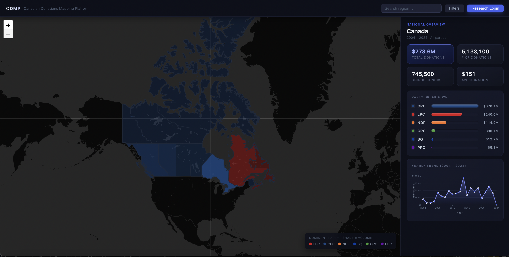

## Project Overview

## Docker and Data Handoff

For local Docker setup, MongoDB dump restore, and full data rebuild
instructions, see [DOCKER.md](./DOCKER.md). Large raw and generated data files
are intentionally kept out of GitHub; see [DATA_README.md](./DATA_README.md)
for the expected external data package layout.

The current handoff package is:

```text
course-project-nacss-drive-upload-2026-07-10.zip
```

Use the Mongo dump restore path for grading or demos. Use the full rebuild path
only when validating the raw donation, PCFRF postal-riding, and riding GeoJSON
pipelines end to end.

## Description

**Product Name**: CDMP (Canadian Donation Map)

**Description**: CDMP is a web application that makes Canada's federal political donation data accessible and easy to explore. Public users can filter aggregated donations by party, time period, geographic level through an interactive map, while authenticated university researchers can access individual-level donation records through a secure login.

**Product Screenshot**:

Public Users Main Screen: 


Filter View of Main Screen: 


Riding Level View of Main Screen: 


Authenticated Research Users Main Screen: 


## Team Information

**Team Name**: NACSS

<table>
  <tr>
    <th>Name</th>
    <th>Email</th>
  </tr>
  <tr>
    <td>Calvin Liew</td>
    <td>calvin.liew@mail.utoronto.ca</td>
  </tr>
  <tr>
    <td>Shahveer Rasool</td>
    <td>shahveer.rasool@mail.utoronto.ca</td>
  </tr>
  <tr>
    <td>Shamrita Saravanakumar</td>
    <td>shamrita.saravanakumar@mail.utoronto.ca</td>
  </tr>
  <tr>
    <td>Abdul Hameed Mohammed</td>
    <td>abdulmus.mohammed@mail.utoronto.ca</td>
  </tr>
  <tr>
    <td>Niveetha Sivakaran</td>
    <td>niveetha.sivakaran@mail.utoronto.ca</td>
  </tr>
</table>

## Project Artifacts


## Design Documents
[Project Proposal](https://github.com/UTSC-CSCC01-Software-Engineering-I/course-project-nacss/blob/2bf47786fab6db0c04cd764defef6ed6fef8bc2c/documentation/CDMP_Proposal_TeamNACSS.pdf)


[Class Diagram](https://github.com/UTSC-CSCC01-Software-Engineering-I/course-project-nacss/blob/c3f23c71c1def50fddaddfb52e888613b31cafa7/documentation/ClassDiagram.png)

## Software Releases
- [Version 0.1.0](https://github.com/UTSC-CSCC01-Software-Engineering-I/course-project-nacss/wiki/Version-0.1.0-Release) - July 9, 2026

## Meeting Minutes
**Demo Meeting Notes**
- [Demo Meeting 1](https://github.com/UTSC-CSCC01-Software-Engineering-I/course-project-nacss/blob/36f78ac6754a0a04fe5f392c9493f94a71361405/meeting_minutes/demo_meeting_minutes/Demo_Meeting_Notes_Template.pdf)
- [Demo Meeting 2](https://github.com/UTSC-CSCC01-Software-Engineering-I/course-project-nacss/blob/c649adaadb4781ee36d142a12efb27eaf79b4acc/meeting_minutes/demo_meeting_minutes/Demo2_Meeting_Notes.pdf)


**Standup Meeting Notes**
- [Standup Meeting May 23 - May 21](https://github.com/UTSC-CSCC01-Software-Engineering-I/course-project-nacss/blob/2bf47786fab6db0c04cd764defef6ed6fef8bc2c/meeting_minutes/stand-up_meeting_minutes/Standup_Meeting_Minutes_May23-May31.pdf)
- [Standup Meeting Jun 1 - Jun 7](https://github.com/UTSC-CSCC01-Software-Engineering-I/course-project-nacss/blob/2bf47786fab6db0c04cd764defef6ed6fef8bc2c/meeting_minutes/stand-up_meeting_minutes/Standup_Meeting_Minutes-Jun1-Jun7.pdf) 
- [Standup Meeting Jun 8 - Jun 14](https://github.com/UTSC-CSCC01-Software-Engineering-I/course-project-nacss/blob/2bf47786fab6db0c04cd764defef6ed6fef8bc2c/meeting_minutes/stand-up_meeting_minutes/Standup_Meeting_Minutes_Jun8-Jun14.pdf)
- [Standup Meeting Jun 15 - Jun 21](https://github.com/UTSC-CSCC01-Software-Engineering-I/course-project-nacss/blob/f4cfd4dcd5b6da3b4b73d8599537a46ea742d27e/meeting_minutes/stand-up_meeting_minutes/Standup_Meeting_Minutes_Jun15-21.pdf)
- [Standup Meeting Jun 22 - Jun 28](https://github.com/UTSC-CSCC01-Software-Engineering-I/course-project-nacss/blob/042b7b60ce09dbe2a03c09316b05253654b5dc45/meeting_minutes/stand-up_meeting_minutes/Standup_Meeting_Minutes_Jun22-28.pdf)
- [Standup Meeting Jun 29 - Jul 5](https://github.com/UTSC-CSCC01-Software-Engineering-I/course-project-nacss/blob/f3265cb0a02591b9c361767332ff43e9daf4c661/meeting_minutes/stand-up_meeting_minutes/Standup_Meeting_Minutes_Jun29-Jul5.pdf)
- [Standup Meeting Jul 6 - Jul 11](https://github.com/UTSC-CSCC01-Software-Engineering-I/course-project-nacss/blob/22f608c36cd6fd98380bda509fc74532da04556b/meeting_minutes/stand-up_meeting_minutes/Standup_Meeting_Minutes_Jul6-11.pdf)
- [Standup Meeting Jul 12 - Jul 18](https://github.com/UTSC-CSCC01-Software-Engineering-I/course-project-nacss/blob/0b45e186a3f680c31636bb3cbc7bd2b463515787/meeting_minutes/stand-up_meeting_minutes/Standup_Meeting_Minutes_Jul12-18.pdf)

## Current Data Coverage and Boundary Buckets

The project data coverage is 1993–2024. Riding-level map views are organized by federal representation order because riding boundaries change over time.

| Donation years | Boundary set | Current frontend geometry |
| --- | --- | --- |
| 1997–2003 | `federal_ridings_1996` | Included under `client/public/data/ridings/federal_ridings_1996/` |
| 2004–2014 | `federal_ridings_2003` | Included under `client/public/data/ridings/federal_ridings_2003/` |
| 2015–2024 | `federal_ridings_2013` | Included under `client/public/data/ridings/federal_ridings_2013/` |
| 2025+ | `federal_ridings_2023` | Included under `client/public/data/ridings/federal_ridings_2023/`; no donation data yet |

The current React app uses the 2013 riding map by default because the default data range ends in 2024. In riding view, users can choose boundary-vintage buckets. The 2025 onward bucket loads the 2023 riding map, but shows a no-data message because CDMP does not currently include post-2024 donation data.

## Riding View Implementation

Clicking a province now drills into a riding-level map for that province. The frontend loads province-specific riding GeoJSON files from `client/public/data/ridings/`, displays the selected boundary set in the active filter badges, and lets the user click a riding to open the summary panel.

The summary panel supports riding-level summaries through the existing `RegionStat` model. If riding stats have not been built yet, the frontend still opens the selected riding and displays a no-data message explaining that riding aggregation needs to be run. For the 2025 onward bucket, the app displays a no-data message because there is currently no donation data for that time frame.

Useful backend commands after importing the donation and postal-riding data:

```bash
cd server
npm run import:opennorth-ridings
npm run seed:boundary-sets
npm run seed:riding-regions
npm run match:donations-to-ridings -- --all
npm run build:timeline-region-stats -- --level riding --beginning-year 2004 --ending-year 2024
```

Useful validation commands:

```bash
cd client
npm run build

cd ../server
npm test -- --watch=false
```

## Authenticated Research Users

Authenticated university researchers can access individual-level donation records through a secure login. To get access a user needs to register their university email and accept the privacy agreement.

## Running Tests

The project has three test suites: backend (Jest + Supertest), frontend unit (Jest), and end-to-end (Cypress). Backend and frontend unit tests mock their dependencies, so they need no database or running server.

### Backend tests (Jest + Supertest)

```bash
cd server
npm test
```

Covers the region statistics endpoints (national/province/riding), research access control, authentication (login, account info, change password), and the analytics endpoint. The database is mocked, so no MongoDB connection is required.

### Frontend unit tests (Jest)

```bash
cd client
npm test
```

Covers the client API layer (region and auth functions) — URL building, query parameters, and error handling. `fetch` is mocked, so no running server is required.

### End-to-end tests (Cypress)

E2E tests run against the live application, so the app must be running via Docker on `http://localhost:8080` first:

```bash
# from the project root
docker compose up -d

cd client
npx cypress run          # run all specs headlessly
# or
npx cypress open         # interactive mode
```

Cypress defaults to `http://localhost:8080` (the Docker port). To run against a local dev server on port 5173 instead:

```bash
CYPRESS_BASE_URL=http://localhost:5173 npx cypress run
```

### What the tests cover

- **Backend API:** region stats (national/province/riding), query parameters, invalid region codes, research access control (401/403), CSV export, auth routes, analytics
- **Frontend unit:** region and auth API clients
- **End-to-end:** national map load, province-to-riding drilldown, boundary-bucket switching, filters (party/year/metric/boundary), search (national and riding views), the 2025-onward no-data state, back-to-national navigation, research login, and the full researcher happy-path


## Handled Warnings and Exception States

The app degrades gracefully instead of crashing or showing blank screens. Handled exception states:

- **Donation map unavailable** — full-screen message when national/province stats fail to load
- **Riding boundaries/stats unavailable** — the riding still opens with a no-data message explaining aggregation hasn't been run
- **2025-onward boundary** — no-data banner (donation data not yet available for that time frame)
- **Search with no matches** — "No Regions Found" / "No Ridings Found"
- **Filtered records return nothing** — "No records found for the current filters" empty-state row
- **Records fail to load** — inline error message on the research dashboard
- **CSV export fails** — inline warning near the Export button ("Export failed. Please try again…")
- **Login authentication fails** — error message shown to the user
- **Not authorized (non-researcher)** — 403 response and Access Denied page
- **Privacy agreement not accepted** — user is prompted to agree before continuing
- **Analytics charts unavailable**

Warnings use plain, non-technical language and do not block map controls, filters, search, or navigation.

## Setup

The user needs to navigate to `/login` and then `/register` where they register their university email (`.ca` or `.edu`) and password. Then the user is sent back to the login page to login.

User needs to make sure in `server/.env` has:
  JWT_SECRET=yoursecretkeyhere

The user then has access to the dashboard where they can view individual donation records and filter by donor type, province, party, year, riding, and search donor name. They can also export a CSV file of the data. As well as, all the queries and exports are logged to the activity log.
